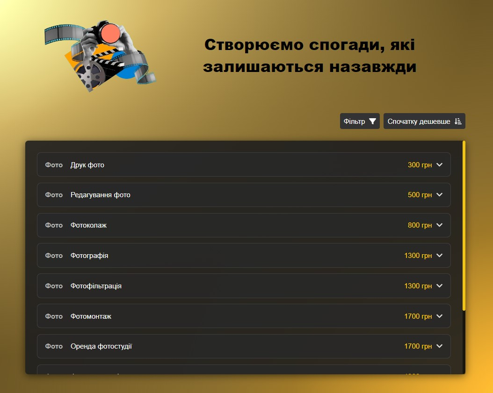

<h1 align="center">Tasks Manager App</h1>

Tasks Manager is a web application for organizing tasks. It allows users to add
tasks to them, and move tasks between different statuses.

## Features

- **Add Tasks:** Users can to add tasks with titles, descriptions and to upload
  different files.
- **Manage Tasks:** The user can change the task status to completed.
- **Edit Tasks:** Users can edit task titles and descriptions directly in the
  application. And also replace attached files.
- **Delete Tasks:** The user can transfer the task to the archive and return to
  it later to make a final decision on it.
- **Filter and Counter:** For ease of use there is a filter and task counter.
- **Search:** The user can find a task by starting to enter any words from its title.

## Technologies Used

 TypeScript, React, Redux, React Router, Bootstrap, Validation Forms, Adaptive Design

