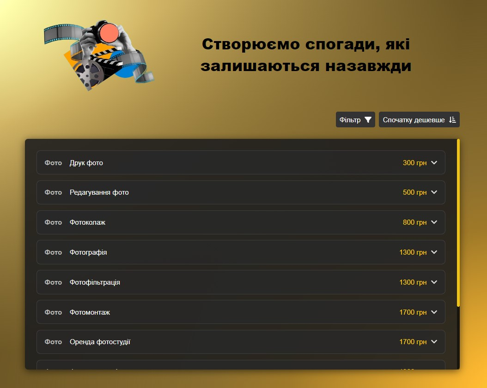

<h1 align="center">Video Studio</h1>

**Video Studio** is a web application designed to create and preserve memories
through photography and videography services. The application provides a
user-friendly interface for users to explore various services, view a dynamic
price list.

## Features

- **Responsive Design**: The application is designed to work seamlessly on
  devices of all sizes, ensuring an optimal user experience.
- **Dynamic Price List**: Users can view a categorized list of services with
  their corresponding prices and open detailed info.
- **Filtering Options**: Users can filter services by type (Photography, Video,
  All Services).
- **Sorting Option**: the user can sort the price list by ascending or
  descending price.

## Technologies Used

- **React**: For building the user interface.
- **TypeScript**: For type safety and better development experience.
- **SCSS**: For styling components with a modular approach.
- **React Icons**: For incorporating scalable vector icons.
